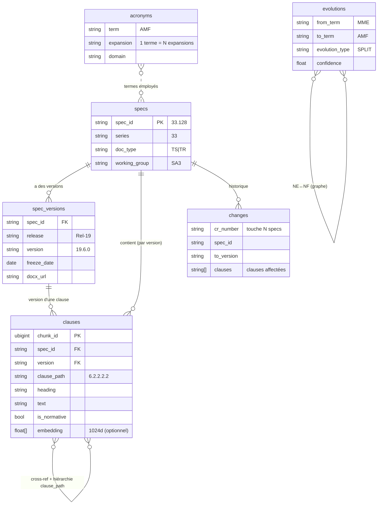

# Comment c'est indexé & les relations entre éléments

Ce document explique **comment le corpus 3GPP est transformé en index interrogeable**
et **quelles relations relient les éléments**. Tout vit dans un seul fichier
**DuckDB** (`data/3gpp.duckdb`) ; le serveur MCP ne fait que lire.

---

## 1. Du HTML aux clauses (pipeline d'ingestion)

```
.zip 3GPP (.doc/.docx)                      scripts/corpus.sh (LibreOffice)
        │                                              │
        ▼                                              ▼
data/sources/origin/<Rel>/<spec>.zip   ──►   data/sources/convert/<Rel>/<spec>.html
                                                       │
                                                       ▼   cmd/ingest (Go)
                                          ┌─────────────────────────────┐
                                          │ internal/htmlparse           │
                                          │  <h1-6> "6.2.2  Titre"  → clause_path + heading
                                          │  <p>/<table>            → texte de la clause
                                          │  annexe "Change history"→ change requests
                                          └─────────────────────────────┘
                                                       │
                                                       ▼
                                              DuckDB  data/3gpp.duckdb
```

**Chunking clause-aware** (jamais une fenêtre de tokens arbitraire) : une clause =
un titre feuille + le texte jusqu'au titre suivant. Le `clause_path` (`6.2.2.2.2`)
est l'identité stable et **porteuse de la hiérarchie**.

---

## 2. Les 6 tables et leurs relations



| Relation | Cardinalité | Porteur | Exemple |
|---|---|---|---|
| spec → versions | 1:N | `spec_versions.spec_id` | `33.128` → Rel-17/18/19 |
| (spec,version) → clauses | 1:N | `clauses.(spec_id,version)` | `33.128 v19.6.0` → 2694 clauses |
| clause ⇄ clause (hiérarchie) | arbre | **préfixe de `clause_path`** | `6.2.2.2` parent de `6.2.2.2.2` |
| clause ⇄ clause (cross-ref) | N:N | mentions `TS/TR dd.ddd` dans le texte | `33.128` → `33.127`, `23.501`… |
| change → spec/version/clauses | 1:N (et CR multi-spec) | `changes.cr_number` + `changes.clauses[]` | une CR modifie 23.501+23.502 |
| term → expansions | 1:N | `acronyms.(term,expansion,domain)` | `AMF` → {Access and Mobility…, Authentication Management Field} |
| NE ⇄ NF | N:N | `evolutions.(from_term,to_term)` | `MME` → `AMF` + `SMF` |

**Points clés :**

- **Ordre des versions** : toujours `(release, version, freeze_date)`, jamais le
  semver seul (`v16.15.0` peut sortir *après* `v17.5.0`). `list_releases` trie
  par ordinal de release décroissant.
- **Acronymes contextuels** : un terme a **plusieurs expansions** (PK
  `(term, expansion, domain)`) ; le serveur les renvoie **toutes**, le client
  tranche selon le contexte (pas d'hallucination).
- **CR multi-spec** : `changes` est indexé par `cr_number`, pas par `spec_id` —
  une CR peut toucher plusieurs specs.
- **Relations NE↔NF** : table `evolutions` (seed curé : `MME→AMF+SMF`,
  `eNB→gNB`, `HSS→UDM+UDR+AUSF`…), interrogée par `trace_evolution`. C'est le
  substitut relationnel V1 du graphe KuzuDB (V2).

---

## 3. Les 3 index sur `clauses`

| Index | Type | Sert à | Construit |
|---|---|---|---|
| **FTS / BM25** | `PRAGMA create_fts_index('clauses','chunk_id','heading','text')` | recherche lexicale classée (mots-clés, IE, NF nominaux) | post-ingestion |
| **HNSW cosine** | `CREATE INDEX … USING HNSW (embedding) WITH (metric='cosine')` | recherche **sémantique** (k-NN sur vecteurs 1024d) | si `EMBEDDER` activé |
| **b-tree métadonnées** | `clauses(spec_id)`, `(release)`, `(spec_id,clause_path)` | filtrage release/série/spec + parcours d'arbre | au schéma |

Les deux extensions DuckDB (`fts`, `vss`) sont **best-effort** : si elles ne se
chargent pas (hors-ligne), la recherche **dégrade en `LIKE`** — visible
(`fts=false`), jamais bloquant.

---

## 4. Comment une requête est résolue (router → fusion)

```
requête ──► internal/search.Classify (regex, CLAUDE.md §3)
            ├─ "TS 33.128"                         → lookup spec
            ├─ "diff entre Rel-18 et Rel-19"       → SQL sur changes
            ├─ "definition of AMF"                 → glossaire (resolve_term)
            ├─ "what replaces MME"                 → evolutions (trace_evolution)
            └─ sinon                               → hybride :
                   BM25 (lexical)  ┐
                                   ├──► RRF (k=60) ──► top-k cité
                   HNSW (vecteurs) ┘   (vecteurs ajoutés si EMBEDDER actif)
```

**RRF** (Reciprocal Rank Fusion) fusionne les listes : `score = Σ 1/(60 + rang_i)`.
Sans vecteurs, il y a une seule liste → l'ordre BM25 est préservé.

Chaque hit porte une **citation** `{spec_id, release, version, clause, url}`.
Pas de citation possible ⇒ pas de réponse.

---

## 5. Le cas POC (Lawful Interception) — relations exploitées

La question *« combien d'events chaque NE/NF remonte en LI_X2 vers le MDF2 »*
n'utilise **que la hiérarchie `clause_path`** de `TS 33.128` :

```
6              Network layer based interception
 6.2           5G            ── génération
  6.2.2        LI at AMF     ── NE/NF  (relation: trimLI(heading) → "AMF")
   6.2.2.2     Generation of xIRI over LI_X2   ── interface X2 → MDF2
    6.2.2.2.2  Registration         ┐
    6.2.2.2.3  Deregistration       ├── EVENTS = enfants directs, hors "General"
    6.2.2.2.9  Handovers            ┘
```

`internal/search.ExtractLIX2Events` : pour chaque clause « Generation of xIRI
over LI_X2 », le NF = ancêtre profondeur-3 (ou nommé dans le titre), les events =
sous-clauses directes non-boilerplate. Résultat cité à la clause exacte.

C'est l'illustration que **les relations entre éléments sont surtout portées par
`clause_path`** (arbre) + les tables `changes`/`acronyms`/`evolutions` pour les
liens transverses.
